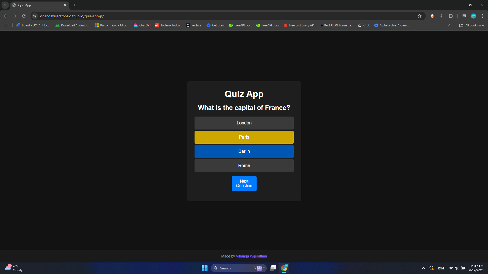

# Quiz App

A simple, interactive quiz application built with vanilla JavaScript, HTML, and CSS. Test your knowledge with multiple-choice questions in a clean, responsive interface.

## Screenshot



## Features

- 🎯 Interactive multiple-choice questions
- 🎨 Modern dark theme design
- 📱 Fully responsive (mobile, tablet, desktop)
- ✅ Real-time answer feedback with color coding
- 📊 Score tracking and results display
- 🔄 Restart functionality
- ⚡ Smooth transitions and hover effects

## Demo

The quiz includes sample questions about:

- Geography (Capital cities)
- Astronomy (Planets)
- Biology (Animals)

## Technologies Used

- **HTML5** - Structure and markup
- **CSS3** - Styling, animations, and responsive design
- **JavaScript (ES6+)** - Interactive functionality and quiz logic

## File Structure

```
quiz-app-js/
├── assets/
│   └── screenshot.png  # Application screenshot
├── index.html          # Main HTML structure
├── script.js           # Quiz logic and interactivity
├── style.css           # Styling and responsive design
└── README.md           # Project documentation
```

## Getting Started

### Prerequisites

- A modern web browser (Chrome, Firefox, Safari, Edge)
- No additional dependencies required

### Installation

1. Clone or download the project files
2. Open `index.html` in your web browser
3. Click "Start Quiz" to begin

### Local Development

For local development, you can use any static file server:

```bash
# Using Python 3
python -m http.server 8000

# Using Node.js (with http-server)
npx http-server

# Using PHP
php -S localhost:8000
```

Then open `http://localhost:8000` in your browser.

## How to Use

1. **Start the Quiz**: Click the "Start Quiz" button
2. **Answer Questions**: Click on your choice from the multiple options
3. **Submit Answer**: Click "Next Question" to proceed
4. **View Feedback**: Correct answers turn green, incorrect ones turn red
5. **See Results**: View your final score at the end
6. **Restart**: Click "Restart Quiz" to try again

## Customization

### Adding Questions

To add more questions, modify the `questions` array in [`script.js`](script.js):

```javascript
const questions = [
  {
    question: "Your question here?",
    choices: ["Option 1", "Option 2", "Option 3", "Option 4"],
    correctAnswer: "Option 2",
  },
  // Add more questions...
];
```

### Styling

Customize the appearance by modifying [`style.css`](style.css). The app uses CSS custom properties for easy theming:

- Background colors: `#121212`, `#1e1e1e`
- Primary color: `#007bff`
- Text color: `#fff`

### Responsive Breakpoints

The app includes responsive design for:

- Mobile: `≤ 480px`
- Small mobile: `≤ 320px`
- Tablet: `≤ 768px`
- Large desktop: `≥ 1200px`

## Browser Support

- Chrome 60+
- Firefox 55+
- Safari 12+
- Edge 79+

## Contributing

1. Fork the project
2. Create your feature branch (`git checkout -b feature/AmazingFeature`)
3. Commit your changes (`git commit -m 'Add some AmazingFeature'`)
4. Push to the branch (`git push origin feature/AmazingFeature`)
5. Open a Pull Request

## License

This project is open source and available under the [MIT License](LICENSE).

## Author

**Vihanga Wijerathna**

- GitHub: [@vihangawijerathna](https://github.com/vihangawijerathna)

## Acknowledgments

- Font: Poppins from Google Fonts
- Color scheme inspired by modern dark UI designs
- Responsive design patterns following mobile-first approach
